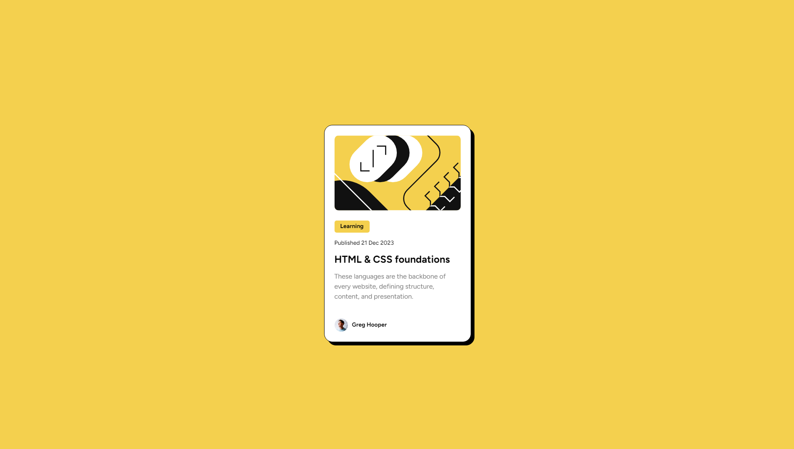

# Frontend Mentor - Blog preview card solution

[English 🇬🇧](README.md)/[Brazillian Portuguese 🇧🇷](README.pt-br.md)

This is a solution to the [Blog preview card challenge on Frontend Mentor](https://www.frontendmentor.io/challenges/blog-preview-card-ckPaj01IcS). Frontend Mentor challenges help you improve your coding skills by building realistic projects.

## Table of contents

- [Overview](#overview)
  - [Screenshot](#screenshot)
  - [Links](#links)
  - [Built with](#built-with)
- [Author](#author)

## Overview

Simple Blog component for the Frontend Mentor Challenge

### Screenshot

### Links

- Solution URL: [Solution Repo](https://github.com/KennedyBarreto/blog-preview-card)
- Live Site URL: [Live Site](https://kennedybarreto.github.io/blog-preview-card)

### Built with

- HTML5
- CSS

## Author

- [Github](https://github.com/KennedyBarreto)
- [LinkedIn](https://www.linkedin.com/in/kennedy-barreto/)
- [Twitter](https://twitter.com/isnt_kennedy)
